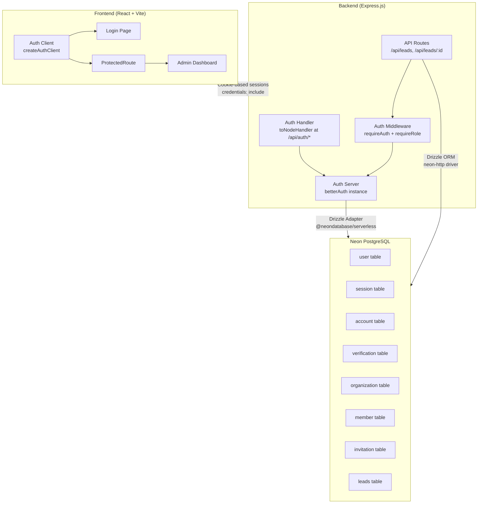
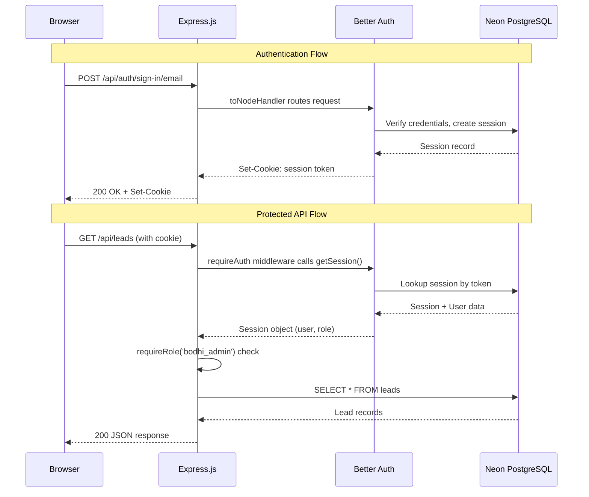
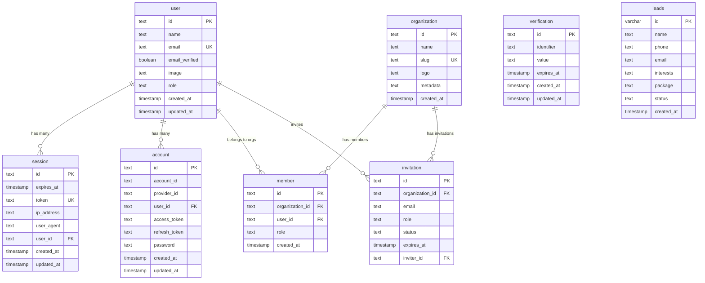

# Design Document: Better Auth Setup

## Overview

This design replaces the insecure shared-password authentication (`bodhi2024` via `X-Admin-Password` header) with Better Auth — a free, open-source, self-hosted authentication library. The migration also fixes the database driver from `pg` (incompatible with Vercel serverless) to `@neondatabase/serverless`.

The system supports two user roles:
- `bodhi_admin` — internal Bodhi Labs staff managing leads and platform operations
- `temple_admin` — temple administrators managing their own temple's subscription and data

Better Auth stores all session, user, and organization data in the existing Neon PostgreSQL database via its native Drizzle ORM adapter. The frontend uses Better Auth's React client for session management, and the backend uses `toNodeHandler` to mount auth routes on Express.js.

### Key Design Decisions

1. **Neon HTTP driver for queries, WebSocket Pool for transactions**: `neon()` from `@neondatabase/serverless` with `drizzle-orm/neon-http` provides lowest latency for single queries in serverless. `Pool` from `@neondatabase/serverless` with `drizzle-orm/neon-serverless` is used for Better Auth (which needs transaction support internally).
2. **Better Auth handler mounted before `express.json()`**: Better Auth manages its own body parsing; mounting after `express.json()` causes body parsing conflicts.
3. **Cookie-based sessions with `credentials: 'include'`**: Better Auth uses HTTP-only cookies for session tokens, which is more secure than localStorage-based tokens.
4. **Organization plugin for role management**: Provides built-in role infrastructure that maps to `bodhi_admin` and `temple_admin` roles.
5. **User `role` field on the `user` table**: A simple `role` column stores the user's role directly, avoiding complex organization lookups for basic role checks.

## Architecture

### High-Level Architecture



### Request Flow



### Express Middleware Stack Order

```
1. Better Auth handler: app.all('/api/auth/*', toNodeHandler(auth))
2. Body parsing:        app.use(express.json())
3. Logging middleware:   app.use(requestLogger)
4. API routes:          app.get('/api/leads', requireAuth, requireRole('bodhi_admin'), handler)
5. Public routes:       app.post('/api/contact', handler)
6. Error handler:       app.use(errorHandler)
```

This ordering is critical — Better Auth must handle its own body parsing before `express.json()` is applied.

## Components and Interfaces

### Backend Components

#### 1. Database Connection (`server/db.ts`)

Replaces the current `pg` driver with `@neondatabase/serverless`.

```typescript
// server/db.ts
import { neon } from '@neondatabase/serverless';
import { drizzle as drizzleHttp } from 'drizzle-orm/neon-http';
import { Pool } from '@neondatabase/serverless';
import { drizzle as drizzlePool } from 'drizzle-orm/neon-serverless';
import * as schema from '@shared/schema';

if (!process.env.DATABASE_URL) {
  throw new Error('DATABASE_URL is not set. Provide a Neon PostgreSQL connection string.');
}

// HTTP driver — lowest latency for single queries (used by app routes)
const sql = neon(process.env.DATABASE_URL);
export const db = drizzleHttp(sql, { schema });

// Pool driver — transaction support (used by Better Auth internally)
const pool = new Pool({ connectionString: process.env.DATABASE_URL });
export const poolDb = drizzlePool(pool, { schema });
```

#### 2. Auth Server (`server/lib/auth.ts`)

Central Better Auth configuration.

```typescript
// server/lib/auth.ts
import { betterAuth } from 'better-auth';
import { drizzleAdapter } from 'better-auth/adapters/drizzle';
import { organization } from 'better-auth/plugins';
import { poolDb } from '../db';

if (!process.env.BETTER_AUTH_SECRET) {
  throw new Error('BETTER_AUTH_SECRET is not set. Generate one with: openssl rand -base64 32');
}

export const auth = betterAuth({
  database: drizzleAdapter(poolDb, { provider: 'pg' }),
  emailAndPassword: { enabled: true },
  plugins: [organization()],
  secret: process.env.BETTER_AUTH_SECRET,
  socialProviders: process.env.GOOGLE_CLIENT_ID && process.env.GOOGLE_CLIENT_SECRET
    ? {
        google: {
          clientId: process.env.GOOGLE_CLIENT_ID,
          clientSecret: process.env.GOOGLE_CLIENT_SECRET,
        },
      }
    : undefined,
});
```

#### 3. Auth Middleware (`server/middleware/auth.ts`)

Reusable Express middleware for session verification and role checks.

```typescript
// server/middleware/auth.ts
import { Request, Response, NextFunction } from 'express';
import { fromNodeHeaders } from 'better-auth/node';
import { auth } from '../lib/auth';

export async function requireAuth(req: Request, res: Response, next: NextFunction) {
  const session = await auth.api.getSession({
    headers: fromNodeHeaders(req.headers),
  });

  if (!session) {
    return res.status(401).json({ success: false, error: 'Unauthorized' });
  }

  (req as any).session = session;
  next();
}

export function requireRole(...allowedRoles: string[]) {
  return (req: Request, res: Response, next: NextFunction) => {
    const userRole = (req as any).session?.user?.role;
    if (!allowedRoles.includes(userRole)) {
      return res.status(403).json({ success: false, error: 'Forbidden' });
    }
    next();
  };
}
```

#### 4. Express Route Mounting (`server/index.ts`)

Modified entry point with Better Auth handler mounted first.

```typescript
// In server/index.ts — key change
import { toNodeHandler } from 'better-auth/node';
import { auth } from './lib/auth';

const app = express();

// 1. Mount Better Auth BEFORE express.json()
app.all('/api/auth/*', toNodeHandler(auth));

// 2. Then body parsing
app.use(express.json());

// 3. Then other routes
registerRoutes(app);
```

#### 5. Protected Routes (`server/routes.ts`)

Updated routes using `requireAuth` and `requireRole` instead of `X-Admin-Password`.

```typescript
// Key changes in server/routes.ts
import { requireAuth, requireRole } from './middleware/auth';

// REMOVE: const ADMIN_PASSWORD = ...
// REMOVE: app.post('/api/admin/auth', ...)

// Protected endpoints
app.get('/api/leads', requireAuth, requireRole('bodhi_admin'), handler);
app.patch('/api/leads/:id', requireAuth, requireRole('bodhi_admin'), handler);

// Public endpoints (unchanged)
app.post('/api/contact', handler);
app.post('/api/leads', handler);
app.post('/api/create-payment-intent', handler);
```

### Frontend Components

#### 6. Auth Client (`client/src/lib/auth-client.ts`)

```typescript
// client/src/lib/auth-client.ts
import { createAuthClient } from 'better-auth/react';
import { organizationClient } from 'better-auth/client/plugins';

export const authClient = createAuthClient({
  baseURL: import.meta.env.VITE_API_URL || '',
  plugins: [organizationClient()],
});

export const { useSession, signIn, signUp, signOut } = authClient;
```

#### 7. ProtectedRoute Component (`client/src/components/ProtectedRoute.tsx`)

```typescript
// client/src/components/ProtectedRoute.tsx
import { useSession } from '@/lib/auth-client';
import { Redirect } from 'wouter';

interface ProtectedRouteProps {
  children: React.ReactNode;
  requiredRole?: string;
}

export function ProtectedRoute({ children, requiredRole }: ProtectedRouteProps) {
  const { data: session, isPending } = useSession();

  if (isPending) {
    return <LoadingSpinner />;
  }

  if (!session) {
    return <Redirect to="/login" />;
  }

  if (requiredRole && session.user.role !== requiredRole) {
    return <AccessDenied />;
  }

  return <>{children}</>;
}
```

#### 8. Login Page (`client/src/pages/Login.tsx`)

A new page at `/login` with email/password fields using Shadcn/ui components, following the Bodhi design system (`#EFE0BD` background, `#991b1b` accent). On successful login, redirects to the appropriate dashboard based on user role.

#### 9. Updated Admin Page (`client/src/pages/Admin.tsx`)

Refactored to use `useSession` instead of the password form. API calls use `credentials: 'include'` instead of `X-Admin-Password` header.

### Interface Contracts

| Endpoint | Method | Auth | Role | Description |
|---|---|---|---|---|
| `/api/auth/*` | ALL | None | None | Better Auth handles sign-in, sign-up, sign-out, session |
| `/api/leads` | GET | requireAuth | bodhi_admin | List all leads |
| `/api/leads/:id` | PATCH | requireAuth | bodhi_admin | Update lead status |
| `/api/leads` | POST | None | None | Public lead submission |
| `/api/contact` | POST | None | None | Public contact form |
| `/api/create-payment-intent` | POST | None | None | Public donation |
| `/login` | Page | None | None | Login page |
| `/admin` | Page | ProtectedRoute | bodhi_admin | Admin dashboard |


## Data Models

### Better Auth Required Tables

Better Auth requires specific tables in the database. These are defined using Drizzle ORM in `shared/schema.ts`.

#### User Table (replaces existing `users` table)

```typescript
export const user = pgTable('user', {
  id: text('id').primaryKey(),
  name: text('name').notNull(),
  email: text('email').notNull().unique(),
  emailVerified: boolean('email_verified').notNull().default(false),
  image: text('image'),
  role: text('role').notNull().default('temple_admin'), // 'bodhi_admin' | 'temple_admin'
  createdAt: timestamp('created_at').notNull().defaultNow(),
  updatedAt: timestamp('updated_at').notNull().defaultNow(),
});
```

#### Session Table

```typescript
export const session = pgTable('session', {
  id: text('id').primaryKey(),
  expiresAt: timestamp('expires_at').notNull(),
  token: text('token').notNull().unique(),
  createdAt: timestamp('created_at').notNull().defaultNow(),
  updatedAt: timestamp('updated_at').notNull().defaultNow(),
  ipAddress: text('ip_address'),
  userAgent: text('user_agent'),
  userId: text('user_id').notNull().references(() => user.id),
});
```

#### Account Table

```typescript
export const account = pgTable('account', {
  id: text('id').primaryKey(),
  accountId: text('account_id').notNull(),
  providerId: text('provider_id').notNull(),
  userId: text('user_id').notNull().references(() => user.id),
  accessToken: text('access_token'),
  refreshToken: text('refresh_token'),
  idToken: text('id_token'),
  accessTokenExpiresAt: timestamp('access_token_expires_at'),
  refreshTokenExpiresAt: timestamp('refresh_token_expires_at'),
  scope: text('scope'),
  password: text('password'),
  createdAt: timestamp('created_at').notNull().defaultNow(),
  updatedAt: timestamp('updated_at').notNull().defaultNow(),
});
```

#### Verification Table

```typescript
export const verification = pgTable('verification', {
  id: text('id').primaryKey(),
  identifier: text('identifier').notNull(),
  value: text('value').notNull(),
  expiresAt: timestamp('expires_at').notNull(),
  createdAt: timestamp('created_at').notNull().defaultNow(),
  updatedAt: timestamp('updated_at').notNull().defaultNow(),
});
```

#### Organization Tables

```typescript
export const organization = pgTable('organization', {
  id: text('id').primaryKey(),
  name: text('name').notNull(),
  slug: text('slug').unique(),
  logo: text('logo'),
  createdAt: timestamp('created_at').notNull().defaultNow(),
  metadata: text('metadata'),
});

export const member = pgTable('member', {
  id: text('id').primaryKey(),
  organizationId: text('organization_id').notNull().references(() => organization.id),
  userId: text('user_id').notNull().references(() => user.id),
  role: text('role').notNull(),
  createdAt: timestamp('created_at').notNull().defaultNow(),
});

export const invitation = pgTable('invitation', {
  id: text('id').primaryKey(),
  organizationId: text('organization_id').notNull().references(() => organization.id),
  email: text('email').notNull(),
  role: text('role'),
  status: text('status').notNull(),
  expiresAt: timestamp('expires_at').notNull(),
  inviterId: text('inviter_id').notNull().references(() => user.id),
});
```

#### Existing Tables (Unchanged)

The `leads` table remains exactly as-is. The old `users` table (with `username`/`password` columns) is replaced by Better Auth's `user` table.

### Entity Relationship Diagram



### Migration Strategy

1. Generate Better Auth tables using `drizzle-kit generate` after adding the new schema definitions
2. Apply with `drizzle-kit push` to the Neon database
3. The old `users` table (with `username`/`password`) can be dropped after migration since no production users exist on it
4. The `leads` table is untouched


## Correctness Properties

*A property is a characteristic or behavior that should hold true across all valid executions of a system — essentially, a formal statement about what the system should do. Properties serve as the bridge between human-readable specifications and machine-verifiable correctness guarantees.*

### Property 1: Unauthenticated requests to protected endpoints return 401

*For any* protected API endpoint (GET /api/leads, PATCH /api/leads/:id) and *for any* request that does not include a valid session cookie, the response status code shall be 401 and the body shall contain `{ success: false, error: 'Unauthorized' }`.

**Validates: Requirements 4.2, 10.1, 10.2**

### Property 2: Authenticated requests with wrong role return 403

*For any* authenticated user whose role is not in the allowed roles for a given endpoint, and *for any* protected endpoint with a role restriction, the response status code shall be 403 and the body shall contain `{ success: false, error: 'Forbidden' }`.

**Validates: Requirements 4.5, 6.4**

### Property 3: Authenticated requests with correct role pass through

*For any* authenticated user whose role matches the required role for a protected endpoint, the middleware shall attach the session to the request and allow the handler to execute (not return 401 or 403).

**Validates: Requirements 4.3**

### Property 4: Session role matches stored user role

*For any* authenticated user (bodhi_admin or temple_admin), the `role` field returned by `useSession` or `auth.api.getSession()` shall match the `role` column stored in the `user` table for that user.

**Validates: Requirements 5.2, 6.2**

### Property 5: Unauthenticated access to protected frontend routes redirects to login

*For any* unauthenticated user (no valid session) accessing any route wrapped with `ProtectedRoute`, the component shall redirect to `/login`.

**Validates: Requirements 5.4, 7.6, 9.2**

### Property 6: Insufficient role on protected frontend route shows access denied

*For any* authenticated user whose role does not match the `requiredRole` prop of a `ProtectedRoute`, the component shall display an "Access Denied" message or redirect to the appropriate dashboard.

**Validates: Requirements 9.3**

### Property 7: Temple admin data isolation

*For any* temple_admin user and *for any* API request that returns data, the response shall only contain data belonging to that temple_admin's own temple (identified by their organization membership).

**Validates: Requirements 6.3**

### Property 8: Login redirects authenticated users by role

*For any* user who is already authenticated and navigates to `/login`, the page shall redirect to the appropriate dashboard based on their role (bodhi_admin → /admin, temple_admin → their temple dashboard).

**Validates: Requirements 8.6**

### Property 9: Invalid credentials produce safe error messages

*For any* invalid email/password combination submitted to the login page, the displayed error message shall not contain internal details such as stack traces, SQL errors, database table names, or server file paths.

**Validates: Requirements 8.3**

### Property 10: Role-based redirect after successful login

*For any* user with valid credentials who signs in, the system shall redirect to the appropriate dashboard based on their role (bodhi_admin → /admin, temple_admin → temple dashboard).

**Validates: Requirements 8.2**

### Property 11: User role invariant

*For any* user record in the `user` table, the `role` field shall be one of the allowed values: `'bodhi_admin'` or `'temple_admin'`.

**Validates: Requirements 11.3**

### Property 12: X-Admin-Password header has no effect

*For any* API endpoint and *for any* request that includes an `X-Admin-Password` header (with any value including the old `bodhi2024`), the header shall have no effect on authorization — the endpoint shall still require a valid Better Auth session.

**Validates: Requirements 12.3**

### Property 13: Missing required environment variable produces descriptive error

*For any* required environment variable (`BETTER_AUTH_SECRET`, `DATABASE_URL`) that is not set, the application shall throw an error at startup whose message identifies the specific missing variable by name.

**Validates: Requirements 13.6, 1.3, 2.6**

## Error Handling

### Backend Error Handling

| Scenario | HTTP Status | Response Body | Notes |
|---|---|---|---|
| No session cookie on protected route | 401 | `{ success: false, error: 'Unauthorized' }` | requireAuth middleware |
| Valid session but wrong role | 403 | `{ success: false, error: 'Forbidden' }` | requireRole middleware |
| Invalid sign-in credentials | 401 | Better Auth default error | Handled by Better Auth at /api/auth/* |
| Missing DATABASE_URL | Startup crash | Error: "DATABASE_URL is not set..." | Fail-fast before any connections |
| Missing BETTER_AUTH_SECRET | Startup crash | Error: "BETTER_AUTH_SECRET is not set..." | Fail-fast before auth init |
| Database connection failure | 500 | `{ success: false, error: 'Internal server error' }` | Log details internally |
| Invalid lead data (Zod) | 400 | `{ message: 'Invalid lead data', errors: [...] }` | Existing behavior preserved |

### Frontend Error Handling

| Scenario | Behavior |
|---|---|
| Session loading (`isPending`) | Show loading spinner |
| No session on protected route | Redirect to `/login` |
| Wrong role on protected route | Show "Access Denied" message |
| Sign-in failure | Display error message (no internal details) |
| Network error during auth | Display generic "Authentication failed" message |
| Session expired mid-use | Next API call returns 401 → redirect to `/login` |

### Error Handling Principles

1. **Fail fast on configuration errors**: Missing env vars throw at startup, not at first request
2. **Generic messages to clients**: Never expose stack traces, SQL errors, or file paths
3. **Detailed internal logging**: `console.error` with full error details for debugging
4. **Graceful degradation**: If Google OAuth env vars are missing, fall back to email/password only

## Testing Strategy

### Dual Testing Approach

This feature requires both unit tests and property-based tests for comprehensive coverage.

#### Unit Tests (Specific Examples and Edge Cases)

Unit tests cover specific scenarios, integration points, and edge cases:

- **Database driver**: Verify `db` instance executes a simple query against Neon (integration test)
- **Auth server creation**: Verify `betterAuth()` initializes without errors
- **Login page rendering**: Verify email/password fields and submit button are present
- **ProtectedRoute loading state**: Verify spinner is shown when `isPending` is true
- **Legacy removal**: Verify `POST /api/admin/auth` returns 404
- **Public endpoints**: Verify `/api/contact`, `POST /api/leads`, `/api/create-payment-intent` don't require auth
- **Environment variable validation**: Verify descriptive errors when `DATABASE_URL` or `BETTER_AUTH_SECRET` are missing
- **Schema tables**: Verify all Better Auth tables exist in the schema definition

#### Property-Based Tests (Universal Properties)

Each correctness property from the design is implemented as a single property-based test with minimum 100 iterations. Use `fast-check` as the property-based testing library for TypeScript.

```
npm install --save-dev fast-check
```

Each test must be tagged with a comment referencing the design property:

```typescript
// Feature: better-auth-setup, Property 1: Unauthenticated requests to protected endpoints return 401
test.prop([fc.constantFrom('/api/leads'), fc.string()], (endpoint, randomHeader) => {
  // For any protected endpoint and any non-session header, response is 401
});
```

**Property test mapping:**

| Property | Test Description | Generator Strategy |
|---|---|---|
| Property 1 | Unauthenticated → 401 | Generate random protected endpoints, random headers without valid session |
| Property 2 | Wrong role → 403 | Generate users with random non-matching roles, random protected endpoints |
| Property 3 | Correct role → pass through | Generate users with matching roles, verify handler executes |
| Property 4 | Session role matches DB | Generate users with random roles, verify session reflects stored role |
| Property 5 | No session → redirect to /login | Generate random protected route paths, verify redirect |
| Property 6 | Wrong role → access denied (frontend) | Generate users with non-matching roles, verify access denied |
| Property 7 | Temple admin data isolation | Generate temple_admin users with org membership, verify data scoping |
| Property 8 | Authenticated on /login → redirect | Generate authenticated users with random roles, verify redirect target |
| Property 9 | Invalid creds → safe error | Generate random invalid email/password combos, verify no internal details in error |
| Property 10 | Valid login → role-based redirect | Generate users with different roles, verify correct redirect destination |
| Property 11 | Role invariant | Generate random user records, verify role is bodhi_admin or temple_admin |
| Property 12 | X-Admin-Password ignored | Generate requests with random X-Admin-Password values, verify no auth bypass |
| Property 13 | Missing env var → descriptive error | For each required env var, unset it and verify error message contains the var name |

### Test Configuration

- **Library**: `fast-check` for property-based testing, `vitest` for test runner
- **Iterations**: Minimum 100 per property test (`fc.assert(..., { numRuns: 100 })`)
- **Tag format**: `Feature: better-auth-setup, Property {number}: {property_text}`
- **Test location**: `__tests__/` directory at project root
- **Each correctness property is implemented by a single property-based test**

