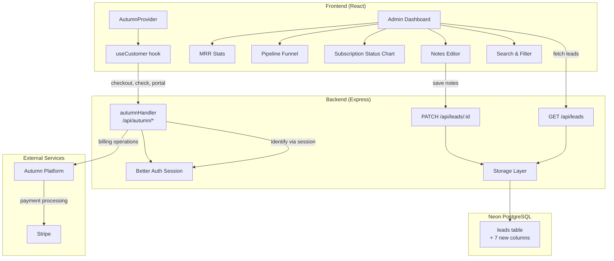
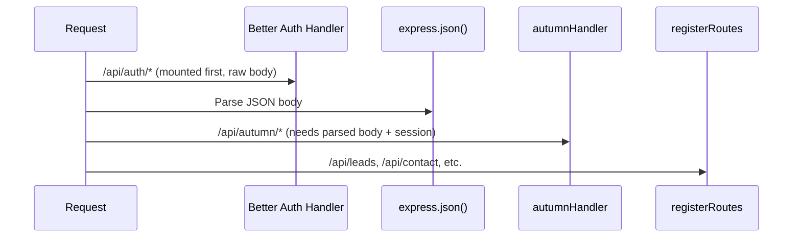

# Tài liệu Thiết kế — Billing Admin Upgrade

## Tổng quan

Tài liệu này mô tả thiết kế kỹ thuật cho việc nâng cấp hệ thống billing và Admin Dashboard của Bodhi Labs. Tính năng bao gồm 4 phần chính:

1. **Tích hợp Autumn SDK** — Backend handler (`autumn-js/express`) và Frontend provider (`autumn-js/react`) cho subscription billing, feature gating, và billing portal
2. **Mở rộng Schema** — Thêm 7 cột mới vào bảng `leads` để lưu thông tin billing (payment_status, plan_tier, monthly_amount, next_billing_date, stripe_customer_id, stripe_subscription_id, notes)
3. **Xác minh Contact Form** — Đảm bảo flow contact form + notification service hoạt động đúng
4. **Nâng cấp Admin Dashboard** — Thống kê MRR, biểu đồ pipeline funnel, biểu đồ subscription status, inline notes editing, tìm kiếm/lọc lead, hiển thị trường billing mới

### Quyết định thiết kế chính

- **Client-side computation**: Thống kê MRR và biểu đồ được tính toán phía client từ dữ liệu leads đã fetch, không cần API endpoint mới cho stats
- **Autumn mount order**: `autumnHandler` mount SAU `express.json()` nhưng TRƯỚC `registerRoutes()` trong `server/index.ts`
- **Backward compatibility**: Tất cả cột mới đều nullable, không ảnh hưởng dữ liệu hiện có
- **Giữ nguyên Stripe donation route**: Route `POST /api/create-payment-intent` không bị thay đổi

## Kiến trúc

### Tổng quan luồng dữ liệu



### Thứ tự mount middleware trong Express



Thứ tự trong `server/index.ts`:
1. `app.all("/api/auth/*", toNodeHandler(auth))` — đã có
2. `app.use(express.json(...))` — đã có
3. `app.use("/api/autumn", autumnHandler({...}))` — **MỚI**
4. `registerRoutes(app)` — đã có


## Thành phần và Giao diện

### 1. Autumn Backend Handler (server/index.ts)

Mount `autumnHandler` từ `autumn-js/express` với hàm `identify` sử dụng Better Auth session:

```typescript
import { autumnHandler } from "autumn-js/express";
import { fromNodeHeaders } from "better-auth/node";
import { auth } from "./lib/auth";

app.use(
  "/api/autumn",
  autumnHandler({
    identify: async (req) => {
      const session = await auth.api.getSession({
        headers: fromNodeHeaders(req.headers),
      });

      if (!session) {
        return { customerId: null };
      }

      return {
        customerId: session.user.id,
        customerData: {
          name: session.user.name,
          email: session.user.email,
        },
      };
    },
  })
);
```

Khi `customerId` là `null`, Autumn SDK tự trả về 401.

### 2. Autumn Frontend Provider (client/src/main.tsx)

Wrap `AutumnProvider` quanh `<App />`:

```typescript
import { AutumnProvider } from "autumn-js/react";

createRoot(document.getElementById("root")!).render(
  <AutumnProvider
    backendUrl={import.meta.env.VITE_AUTUMN_BACKEND_URL || ""}
    includeCredentials={true}
  >
    <App />
  </AutumnProvider>
);
```

### 3. Mở rộng PATCH /api/leads/:id (server/routes.ts)

Mở rộng route hiện tại để chấp nhận thêm các trường billing:

```typescript
app.patch("/api/leads/:id", requireAuth, requireRole("bodhi_admin"), async (req, res) => {
  const { status, notes, payment_status, plan_tier, monthly_amount,
          next_billing_date, stripe_customer_id, stripe_subscription_id } = req.body;

  // Validate enums
  const validStatuses = ["new", "contacted", "qualified", "converted", "lost"];
  const validPaymentStatuses = ["unpaid", "active", "overdue", "cancelled"];
  const validPlanTiers = ["basic", "standard", "premium"];

  if (status && !validStatuses.includes(status)) { return res.status(400)... }
  if (payment_status && !validPaymentStatuses.includes(payment_status)) { return res.status(400)... }
  if (plan_tier && !validPlanTiers.includes(plan_tier)) { return res.status(400)... }

  const lead = await storage.updateLead(id, updateFields);
  res.json(lead);
});
```

### 4. Storage Layer mở rộng (server/storage.ts)

Thêm method `updateLead` tổng quát thay vì chỉ `updateLeadStatus`:

```typescript
interface LeadUpdate {
  status?: string;
  notes?: string;
  paymentStatus?: string;
  planTier?: string;
  monthlyAmount?: number;
  nextBillingDate?: Date;
  stripeCustomerId?: string;
  stripeSubscriptionId?: string;
}

async updateLead(id: string, data: LeadUpdate): Promise<Lead | undefined> {
  const result = await db.update(leads).set(data).where(eq(leads.id, id)).returning();
  return result[0];
}
```

### 5. Admin Dashboard Components (client/src/pages/Admin.tsx)

Cấu trúc component mới trong Admin.tsx:

```
Admin.tsx
├── Header (giữ nguyên + thêm search bar)
├── MRR Stats Cards (tổng MRR, active subs, new leads tháng này)
├── Charts Section
│   ├── Pipeline Funnel Chart (Recharts BarChart)
│   └── Subscription Status Chart (Recharts PieChart)
├── Filter Bar (status filter, payment_status filter)
└── Lead List (mở rộng lead cards)
    ├── Payment Status Badge (màu theo trạng thái)
    ├── Plan Tier Display
    ├── Inline Notes Editor (textarea toggle)
    └── Status Buttons (giữ nguyên)
```

### 6. MRR Stats Computation (client-side)

```typescript
function computeStats(leads: Lead[]) {
  const activeSubs = leads.filter(l => l.paymentStatus === "active");
  const totalMRR = activeSubs.reduce((sum, l) => sum + (l.monthlyAmount || 0), 0);
  const now = new Date();
  const newThisMonth = leads.filter(l => {
    const d = new Date(l.createdAt);
    return d.getMonth() === now.getMonth() && d.getFullYear() === now.getFullYear();
  });
  return { totalMRR, activeCount: activeSubs.length, newCount: newThisMonth.length };
}
```

### 7. Search & Filter (client-side)

```typescript
function filterLeads(leads: Lead[], search: string, statusFilter: string, paymentFilter: string) {
  return leads.filter(lead => {
    const matchesSearch = !search ||
      lead.name.toLowerCase().includes(search.toLowerCase()) ||
      lead.email.toLowerCase().includes(search.toLowerCase()) ||
      lead.phone.includes(search);
    const matchesStatus = !statusFilter || lead.status === statusFilter;
    const matchesPayment = !paymentFilter || lead.paymentStatus === paymentFilter;
    return matchesSearch && matchesStatus && matchesPayment;
  });
}
```


## Mô hình Dữ liệu

### Bảng `leads` — Schema mở rộng

```typescript
// shared/schema.ts
export const leads = pgTable("leads", {
  // ─── Existing columns ───
  id: varchar("id").primaryKey().default(sql`gen_random_uuid()`),
  name: text("name").notNull(),
  phone: text("phone").notNull(),
  email: text("email").notNull(),
  interests: text("interests"),
  package: text("package").notNull(),
  status: text("status").notNull().default("new"),
  createdAt: timestamp("created_at").defaultNow().notNull(),

  // ─── New billing columns (all nullable) ───
  paymentStatus: text("payment_status").default("unpaid"),
  planTier: text("plan_tier"),
  monthlyAmount: integer("monthly_amount"),
  nextBillingDate: timestamp("next_billing_date"),
  stripeCustomerId: text("stripe_customer_id"),
  stripeSubscriptionId: text("stripe_subscription_id"),
  notes: text("notes"),
});
```

### Enum Values

| Column | Valid Values | Default |
|--------|-------------|---------|
| `status` | new, contacted, qualified, converted, lost | new |
| `payment_status` | unpaid, active, overdue, cancelled | unpaid |
| `plan_tier` | basic, standard, premium | null |

### Autumn Products

| Product ID | Price | Type | Description |
|-----------|-------|------|-------------|
| `basic` | $99/month | Recurring | Gói cơ bản |
| `standard` | $199/month | Recurring | Gói tiêu chuẩn |
| `premium` | $299/month | Recurring | Gói cao cấp |
| `onboarding` | $500 | One-time | Phí onboarding |

### insertLeadSchema Update

```typescript
export const insertLeadSchema = createInsertSchema(leads).omit({
  id: true,
  createdAt: true,
  // Omit billing fields — set by admin, not by lead submission
  paymentStatus: true,
  planTier: true,
  monthlyAmount: true,
  nextBillingDate: true,
  stripeCustomerId: true,
  stripeSubscriptionId: true,
  notes: true,
});
```

### Lead Update Validation Schema

```typescript
export const updateLeadSchema = z.object({
  status: z.enum(["new", "contacted", "qualified", "converted", "lost"]).optional(),
  paymentStatus: z.enum(["unpaid", "active", "overdue", "cancelled"]).optional(),
  planTier: z.enum(["basic", "standard", "premium"]).optional(),
  monthlyAmount: z.number().int().positive().optional(),
  nextBillingDate: z.string().datetime().optional(),
  stripeCustomerId: z.string().optional(),
  stripeSubscriptionId: z.string().optional(),
  notes: z.string().optional(),
});
```


## Correctness Properties

*A property is a characteristic or behavior that should hold true across all valid executions of a system — essentially, a formal statement about what the system should do. Properties serve as the bridge between human-readable specifications and machine-verifiable correctness guarantees.*

### Property 1: Identify function maps session to customer data

*For any* valid Better Auth session containing a user with id, name, and email, the Autumn `identify` function should return a `customerId` equal to the user's id and `customerData` containing the user's name and email. For any request without a valid session, it should return `customerId: null`.

**Validates: Requirements 1.2, 1.3**

### Property 2: Lead update validation rejects invalid enum values

*For any* string not in the set `{unpaid, active, overdue, cancelled}` provided as `payment_status`, or any string not in `{basic, standard, premium}` provided as `plan_tier`, or any non-positive-integer provided as `monthly_amount`, the update lead validation should reject the input.

**Validates: Requirements 4.1, 4.2, 4.3, 5.2, 5.3**

### Property 3: Lead creation backward compatibility

*For any* valid lead data containing only the original fields (name, phone, email, package), creating the lead should succeed and the new billing columns should have their default values (payment_status = "unpaid", all others null).

**Validates: Requirements 4.8, 4.9**

### Property 4: Lead update round-trip

*For any* existing lead and any valid combination of update fields (status, payment_status, plan_tier, monthly_amount, notes, etc.), after a successful PATCH update, fetching the lead should return the updated values for all changed fields while preserving unchanged fields.

**Validates: Requirements 5.1**

### Property 5: Contact form validation rejects missing required fields

*For any* contact form submission missing at least one of the required fields (firstName, lastName, email), the `/api/contact` endpoint should return HTTP 400.

**Validates: Requirements 6.4**

### Property 6: MRR stats computation correctness

*For any* list of leads with various `payment_status` and `monthly_amount` values, the computed `totalMRR` should equal the sum of `monthly_amount` for leads where `payment_status === "active"`, the `activeCount` should equal the count of such leads, and `newThisMonth` should equal the count of leads with `createdAt` in the current calendar month.

**Validates: Requirements 7.1, 7.2, 7.3**

### Property 7: Pipeline funnel computation

*For any* list of leads, the pipeline funnel data should contain exactly 5 entries in the fixed order `[new, contacted, qualified, converted, lost]`, and each entry's count should equal the number of leads with that status. All 5 statuses must appear even when their count is 0.

**Validates: Requirements 8.1, 8.2, 8.3**

### Property 8: Subscription status distribution computation

*For any* list of leads, the subscription status distribution should contain entries for each `payment_status` value (unpaid, active, overdue, cancelled), and each entry's count should equal the number of leads with that payment_status.

**Validates: Requirements 9.1, 9.2**

### Property 9: Lead filter composition

*For any* list of leads, any search string, any status filter value, and any payment_status filter value, the filtered result should be exactly the set of leads that match ALL active filters simultaneously: (a) name, email, or phone contains the search string (case-insensitive), AND (b) status equals the status filter (if set), AND (c) payment_status equals the payment filter (if set).

**Validates: Requirements 11.1, 11.2, 11.3, 11.5**

### Property 10: Payment status badge color mapping completeness

*For any* valid `payment_status` value (including null/undefined), the badge color mapping function should return a defined color class. For null/undefined values, it should return the default display label.

**Validates: Requirements 12.1, 12.4**


## Xử lý Lỗi

### Backend Error Handling

| Scenario | HTTP Status | Response |
|----------|-------------|----------|
| Không có session khi gọi `/api/autumn/*` | 401 | `{ error: "Unauthorized" }` |
| Không có session khi gọi protected routes | 401 | `{ success: false, error: "Unauthorized" }` |
| User không có role `bodhi_admin` | 403 | `{ success: false, error: "Forbidden" }` |
| Invalid `payment_status` enum | 400 | `{ message: "Invalid payment_status. Must be one of: unpaid, active, overdue, cancelled" }` |
| Invalid `plan_tier` enum | 400 | `{ message: "Invalid plan_tier. Must be one of: basic, standard, premium" }` |
| Lead không tồn tại (PATCH) | 404 | `{ message: "Lead not found" }` |
| Contact form thiếu required fields | 400 | `{ message: "First name, last name, and email are required" }` |
| Resend chưa cấu hình | 503 | `{ message: "Email service is not configured" }` |
| Database error | 500 | `{ success: false, error: "Internal server error" }` |

### Frontend Error Handling

- **API fetch failures**: Hiển thị toast error qua `useToast` hook
- **Notes save failure**: Hiển thị toast error, giữ nguyên nội dung textarea để user retry
- **Empty leads state**: Hiển thị placeholder message "No leads yet"
- **Chart empty state**: Subscription chart hiển thị "Chưa có dữ liệu subscription" khi tất cả leads đều unpaid

### Autumn Error Handling

- Autumn SDK tự xử lý checkout errors và hiển thị cho user
- Nếu `identify` trả về `customerId: null`, Autumn SDK trả về 401 tự động
- `AUTUMN_SECRET_KEY` thiếu: Log warning khi server start, Autumn routes sẽ fail gracefully

## Chiến lược Testing

### Dual Testing Approach

Sử dụng kết hợp unit tests và property-based tests:

- **Unit tests**: Kiểm tra các ví dụ cụ thể, edge cases, và error conditions
- **Property tests**: Kiểm tra các thuộc tính phổ quát trên nhiều input ngẫu nhiên

### Property-Based Testing

- **Library**: `fast-check` (JavaScript/TypeScript PBT library)
- **Test runner**: Vitest
- **Minimum iterations**: 100 per property test
- **Tag format**: `Feature: billing-admin-upgrade, Property {number}: {property_text}`
- Mỗi correctness property được implement bởi MỘT property-based test duy nhất

### Unit Tests

Unit tests tập trung vào:
- Ví dụ cụ thể cho Autumn identify function (có session, không session)
- Edge cases: empty leads list, all leads unpaid, leads with null billing fields
- Integration: PATCH route với middleware auth check
- Error conditions: invalid enum values, missing required fields

### Test Coverage Map

| Property | Test Type | Target Function/Module |
|----------|-----------|----------------------|
| Property 1 | Property + Unit | Autumn identify function |
| Property 2 | Property | updateLeadSchema validation |
| Property 3 | Property | insertLeadSchema + lead creation |
| Property 4 | Property | storage.updateLead round-trip |
| Property 5 | Property | Contact form validation |
| Property 6 | Property | computeStats function |
| Property 7 | Property | computeFunnelData function |
| Property 8 | Property | computeSubscriptionDistribution function |
| Property 9 | Property | filterLeads function |
| Property 10 | Property | getPaymentStatusColor / getDefaultLabel functions |

### Các hàm cần extract để test

Để property-test được, các computation functions cần được extract ra khỏi React components:

1. `computeStats(leads: Lead[])` → `{ totalMRR, activeCount, newThisMonth }`
2. `computeFunnelData(leads: Lead[])` → `FunnelEntry[]`
3. `computeSubscriptionDistribution(leads: Lead[])` → `DistributionEntry[]`
4. `filterLeads(leads: Lead[], search, statusFilter, paymentFilter)` → `Lead[]`
5. `getPaymentStatusColor(status: string | null)` → `string`
6. `getDefaultDisplayLabel(field: string, value: string | null)` → `string`

Các hàm này nên được đặt trong một file utility riêng (ví dụ: `client/src/lib/admin-utils.ts`) để dễ import trong cả component và test files.
