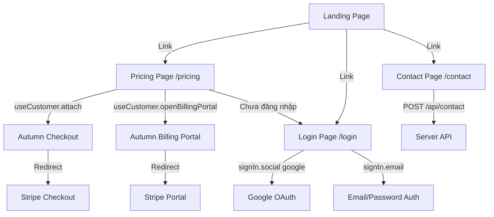
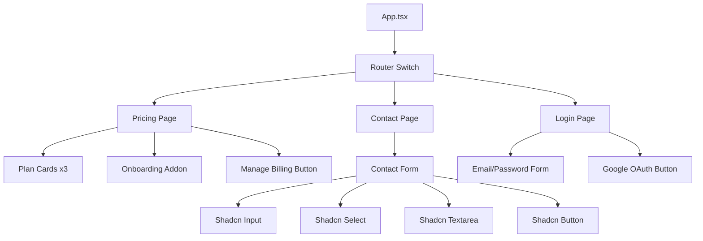

# Tài liệu Thiết kế — Frontend Billing & Contact

## Tổng quan

Tính năng này bổ sung 4 phần frontend cho ứng dụng Bodhi Labs:

1. **Pricing Page** (`/pricing`): Hiển thị 3 gói subscription (basic, standard, premium) và add-on onboarding, tích hợp Autumn SDK checkout
2. **Contact Page** (`/contact`): Form liên hệ với Shadcn/ui components, gửi dữ liệu đến `/api/contact`
3. **Google OAuth Button**: Nút đăng nhập Google trên Login Page, sử dụng Better Auth `signIn.social`
4. **Navigation Updates**: Đăng ký routes mới và thêm liên kết điều hướng trên Landing page

Tất cả logic xử lý phía client. Không cần API endpoint mới — `/api/contact` và Autumn handler (`/api/autumn`) đã có sẵn.

## Kiến trúc

### Tổng quan luồng dữ liệu



### Quyết định thiết kế

1. **Autumn SDK `useCustomer` hook**: Sử dụng trực tiếp `attach()` cho checkout và `openBillingPortal()` cho billing portal. AutumnProvider đã wrap toàn bộ app trong `main.tsx` với `includeCredentials: true`.

2. **Client-side form validation**: Contact form validate phía client trước khi gửi request. Sử dụng React state + regex cho email validation, không cần thư viện form phức tạp (react-hook-form) vì form đơn giản.

3. **Shadcn/ui components**: Tận dụng các component có sẵn (Input, Select, Textarea, Button, Label, Card) để đảm bảo nhất quán với design system.

4. **Better Auth `signIn.social`**: Gọi trực tiếp từ auth-client đã export, với `provider: "google"` và `callbackURL: "/"`.

5. **Wouter routing**: Thêm routes mới vào `App.tsx` Switch, nhất quán với pattern hiện tại.

## Components và Interfaces

### Trang mới

#### 1. PricingPage (`client/src/pages/Pricing.tsx`)

```typescript
// Dependencies
import { useCustomer } from "autumn-js/react";
import { useSession } from "@/lib/auth-client";
import { useLocation } from "wouter";
import { Card } from "@/components/ui/card";

// Pricing data (hardcoded, client-side)
interface PlanConfig {
  id: string;           // "basic" | "standard" | "premium"
  name: string;
  price: number;        // monthly USD
  features: string[];
  highlighted?: boolean;
}

// Component sử dụng useCustomer hook từ Autumn SDK
// - attach(productId): Khởi tạo checkout session
// - openBillingPortal({ returnUrl }): Mở billing portal
// - Kiểm tra session để quyết định hiển thị "Subscribe" vs redirect to login
```

#### 2. ContactPage (`client/src/pages/Contact.tsx`)

```typescript
// Dependencies
import { Input } from "@/components/ui/input";
import { Select, SelectContent, SelectItem, SelectTrigger, SelectValue } from "@/components/ui/select";
import { Textarea } from "@/components/ui/textarea";
import { Button } from "@/components/ui/button";
import { Label } from "@/components/ui/label";
import { useToast } from "@/hooks/use-toast";

// Form state interface
interface ContactFormData {
  firstName: string;      // bắt buộc
  lastName: string;       // bắt buộc
  email: string;          // bắt buộc, validate format
  organizationName: string;
  role: string;
  organizationType: string;
  communitySize: string;
  message: string;
}

// Validation function (pure, testable)
interface ValidationResult {
  valid: boolean;
  errors: Record<string, string>;
}

function validateContactForm(data: ContactFormData): ValidationResult;
```

### Components được sửa đổi

#### 3. Login Page (`client/src/pages/Login.tsx`)

Thêm Google OAuth button bên dưới form email/password hiện tại:

```typescript
// Thêm vào sau </form> hiện tại:
// - Divider "or"
// - Google OAuth button gọi signIn.social({ provider: "google", callbackURL: "/" })
// - Loading state + error handling tích hợp vào error state hiện có
```

#### 4. App.tsx — Route Registration

```typescript
// Thêm 2 routes mới:
// <Route path="/pricing" component={Pricing} />
// <Route path="/contact" component={ContactPage} />
```

#### 5. Landing.tsx — Navigation Links

Thêm links đến `/pricing` và `/contact` trong header navigation và/hoặc CTA sections.

### Component Hierarchy



## Data Models

### Contact Form Data

```typescript
interface ContactFormData {
  firstName: string;
  lastName: string;
  email: string;
  organizationName: string;
  role: string;
  organizationType: string;  // "temple" | "monastery" | "center" | "organization" | "other"
  communitySize: string;     // "1-50" | "51-200" | "201-500" | "500+"
  message: string;
}
```

### Pricing Plan Config

```typescript
interface PlanConfig {
  id: "basic" | "standard" | "premium";
  name: string;
  price: number;
  period: string;       // "/tháng"
  features: string[];
  highlighted: boolean; // true cho gói recommended
}

interface AddonConfig {
  id: "onboarding";
  name: string;
  price: number;
  description: string;
  features: string[];
}

// Hardcoded data — không cần fetch từ server
const PLANS: PlanConfig[] = [
  { id: "basic", name: "Basic", price: 99, period: "/tháng", features: [...], highlighted: false },
  { id: "standard", name: "Standard", price: 199, period: "/tháng", features: [...], highlighted: true },
  { id: "premium", name: "Premium", price: 299, period: "/tháng", features: [...], highlighted: false },
];

const ONBOARDING_ADDON: AddonConfig = {
  id: "onboarding",
  name: "Onboarding",
  price: 500,
  description: "Dịch vụ onboarding một lần",
  features: [...],
};
```

### Validation Types

```typescript
interface ValidationResult {
  valid: boolean;
  errors: Record<string, string>;  // field name -> error message
}

// Email regex pattern
const EMAIL_REGEX = /^[^\s@]+@[^\s@]+\.[^\s@]+$/;
```

### API Request/Response (Contact Form)

```typescript
// Request: POST /api/contact
interface ContactRequest {
  firstName: string;
  lastName: string;
  email: string;
  organizationName?: string;
  role?: string;
  organizationType?: string;
  communitySize?: string;
  message?: string;
}

// Response 200:
interface ContactSuccessResponse {
  success: true;
  message: string;
}

// Response 4xx/5xx:
interface ContactErrorResponse {
  message: string;
}
```


## Correctness Properties

*A property is a characteristic or behavior that should hold true across all valid executions of a system — essentially, a formal statement about what the system should do. Properties serve as the bridge between human-readable specifications and machine-verifiable correctness guarantees.*

### Property 1: Contact form validation rejects invalid input

*For any* string that is empty or composed entirely of whitespace used as `firstName` or `lastName`, and *for any* string that does not match a valid email format used as `email`, the `validateContactForm` function should return `{ valid: false }` with appropriate error messages for the invalid fields.

**Validates: Requirements 3.8**

### Property 2: Contact form validation accepts valid input

*For any* non-empty, non-whitespace-only `firstName` and `lastName`, and *for any* string matching a valid email format as `email`, the `validateContactForm` function should return `{ valid: true, errors: {} }` regardless of the values of optional fields (`organizationName`, `role`, `organizationType`, `communitySize`, `message`).

**Validates: Requirements 3.8, 3.3**

### Property 3: Successful contact submission resets all form fields

*For any* valid `ContactFormData` that results in a successful API response (status 200), after submission completes, all form fields (both required and optional) should be reset to their initial empty string values.

**Validates: Requirements 3.4**

### Property 4: Error response produces error notification

*For any* API response with status code in the 4xx or 5xx range, the contact form submission handler should trigger an error toast notification containing a descriptive error message, and the form fields should remain unchanged (not reset).

**Validates: Requirements 3.5**

## Error Handling

### Contact Form

| Tình huống | Xử lý |
|---|---|
| Trường bắt buộc trống | Hiển thị inline error message dưới trường, disable nút Submit |
| Email format không hợp lệ | Hiển thị inline error "Email không hợp lệ" dưới trường email |
| API trả về 4xx | Toast error với message từ response body |
| API trả về 5xx | Toast error với message chung "Có lỗi xảy ra, vui lòng thử lại" |
| Network error (fetch fails) | Toast error "Lỗi mạng, vui lòng thử lại" |

### Pricing Page

| Tình huống | Xử lý |
|---|---|
| Chưa đăng nhập nhấn Subscribe | Redirect đến `/login` |
| Autumn `attach()` thất bại | Toast error thông báo lỗi checkout |
| Autumn `openBillingPortal()` thất bại | Toast error thông báo lỗi billing portal |

### Login Page — Google OAuth

| Tình huống | Xử lý |
|---|---|
| `signIn.social` trả về error | Hiển thị error message trong khu vực error hiện có |
| Google OAuth popup bị chặn | Error message "Đăng nhập Google thất bại" |
| Network error | Error message "Lỗi mạng, vui lòng thử lại" |

## Testing Strategy

### Dual Testing Approach

Sử dụng kết hợp unit tests và property-based tests:

- **Unit tests**: Kiểm tra các ví dụ cụ thể, edge cases, và integration points
- **Property tests**: Kiểm tra các thuộc tính phổ quát trên nhiều input ngẫu nhiên

### Property-Based Testing

- **Thư viện**: `fast-check` (cho TypeScript/JavaScript)
- **Cấu hình**: Mỗi property test chạy tối thiểu 100 iterations
- **Tag format**: `Feature: frontend-billing-contact, Property {number}: {property_text}`

Mỗi correctness property ở trên sẽ được implement bằng MỘT property-based test duy nhất sử dụng `fast-check`:

1. **Property 1** — Generate random whitespace strings và invalid emails, verify validation rejects
2. **Property 2** — Generate random valid names và emails, verify validation accepts
3. **Property 3** — Generate random valid form data, mock successful API, verify form reset
4. **Property 4** — Generate random error status codes (400-599), verify error toast triggered

### Unit Tests

Unit tests tập trung vào:

- **Pricing Page**: Verify 3 plan cards render với đúng giá, verify addon section render, verify Subscribe button behavior (logged in vs not logged in), verify Manage Billing button visibility
- **Contact Page**: Verify form renders tất cả fields, verify loading state khi submitting, verify route registration
- **Login Page**: Verify Google OAuth button render, verify `signIn.social` called với đúng params, verify error display, verify loading state
- **Navigation**: Verify routes `/pricing` và `/contact` registered trong App.tsx, verify links trên Landing page

### Test Files

```
client/src/__tests__/
├── contact-validation.test.ts      # Property tests cho validateContactForm
├── contact-form.test.tsx           # Unit tests cho ContactPage component
├── pricing-page.test.tsx           # Unit tests cho PricingPage component
├── login-google-oauth.test.tsx     # Unit tests cho Google OAuth button
└── navigation.test.tsx             # Unit tests cho route registration
```
