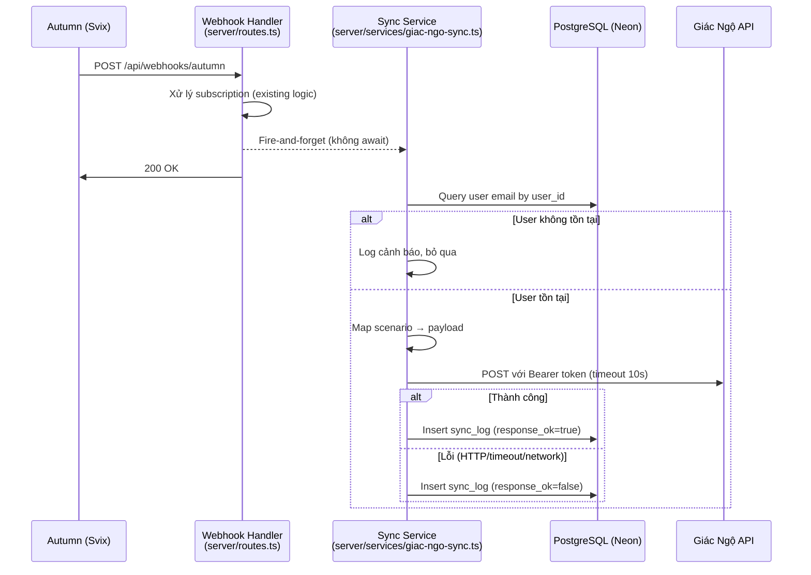

# Thiết kế — Đồng bộ Subscription Bodhi → Giác Ngộ

## Tổng quan

Module đồng bộ một chiều (fire-and-forget) gửi trạng thái subscription từ Bodhi sang REST API của Giác Ngộ mỗi khi Autumn webhook `customer.products.updated` được xử lý. Mọi lần gọi đều được ghi log vào bảng `giac_ngo_sync_log` để theo dõi và debug. Lỗi từ Giác Ngộ API không ảnh hưởng đến luồng xử lý webhook chính.

## Kiến trúc



Điểm quan trọng:
- Webhook handler gọi sync service bằng `syncToGiacNgo(...).catch(...)` — không `await`, không block response
- Sync service tự xử lý mọi exception nội bộ, không throw ra ngoài
- Timeout 10 giây cho mỗi request đến Giác Ngộ API

## Components và Interfaces

### 1. Sync Service (`server/services/giac-ngo-sync.ts`)

```typescript
interface SyncPayload {
  user_id: string;
  email: string;
  plan: string;
  status: string; // "active" | "unsubscribe" | "past_due"
}

interface SyncLogEntry {
  userId: string;
  eventType: string;
  payload: string;       // JSON.stringify(SyncPayload)
  responseOk: boolean;
  responseStatus: number | null;
  errorMessage: string | null;
}

/**
 * Hàm chính — gọi từ webhook handler
 * Tự xử lý mọi lỗi, không throw exception
 */
export async function syncToGiacNgo(params: {
  userId: string;
  scenario: string;
  productId: string;
}): Promise<void>;

/**
 * Map scenario từ Autumn sang status cho Giác Ngộ
 */
export function mapScenarioToStatus(scenario: string): string;

/**
 * Map scenario sang plan (product ID) — trả về productId hoặc empty string cho cancel/expired
 */
export function mapScenarioToPlan(scenario: string, productId: string): string;
```

### 2. Webhook Handler Integration (`server/routes.ts`)

Thêm một dòng fire-and-forget sau khi xử lý subscription hiện tại:

```typescript
// Sau storage.upsertSubscription(...)
syncToGiacNgo({ userId, scenario, productId: updated_product.id })
  .catch(err => console.error("[Giác Ngộ Sync] Unexpected error:", err));
```

### 3. Schema Addition (`shared/schema.ts`)

Thêm bảng `giac_ngo_sync_log` với Drizzle ORM, theo pattern hiện có.

## Data Models

### Bảng `giac_ngo_sync_log`

| Cột | Kiểu | Ràng buộc |
|-----|------|-----------|
| `id` | `varchar` | Primary key, `gen_random_uuid()` |
| `user_id` | `text` | Foreign key → `user.id` |
| `event_type` | `text` | Not null (scenario từ Autumn) |
| `payload` | `text` | Not null (JSON string đã gửi) |
| `response_ok` | `boolean` | Not null |
| `response_status` | `integer` | Nullable |
| `error_message` | `text` | Nullable |
| `created_at` | `timestamp` | Default `now()` |

Indexes:
- `giac_ngo_sync_log_userId_idx` trên `user_id`
- `giac_ngo_sync_log_createdAt_idx` trên `created_at`

### Drizzle Schema Definition

```typescript
export const giacNgoSyncLog = pgTable(
  "giac_ngo_sync_log",
  {
    id: varchar("id").primaryKey().default(sql`gen_random_uuid()`),
    userId: text("user_id")
      .notNull()
      .references(() => user.id, { onDelete: "cascade" }),
    eventType: text("event_type").notNull(),
    payload: text("payload").notNull(),
    responseOk: boolean("response_ok").notNull(),
    responseStatus: integer("response_status"),
    errorMessage: text("error_message"),
    createdAt: timestamp("created_at").defaultNow().notNull(),
  },
  (table) => [
    index("giac_ngo_sync_log_userId_idx").on(table.userId),
    index("giac_ngo_sync_log_createdAt_idx").on(table.createdAt),
  ]
);
```

### Scenario → Payload Mapping

| Scenario | `status` | `plan` |
|----------|----------|--------|
| `new` | `"active"` | productId |
| `renew` | `"active"` | productId |
| `upgrade` | `"active"` | productId |
| `downgrade` | `"active"` | productId |
| `scheduled` | `"active"` | productId |
| `cancel` | `"unsubscribe"` | productId |
| `expired` | `"unsubscribe"` | productId |
| `past_due` | `"past_due"` | productId |


## Correctness Properties

*Một property là đặc tính hoặc hành vi phải luôn đúng trong mọi lần thực thi hợp lệ của hệ thống — về bản chất là một phát biểu hình thức về những gì hệ thống phải làm. Properties là cầu nối giữa đặc tả dễ đọc cho con người và đảm bảo tính đúng đắn có thể kiểm chứng bằng máy.*

### Property 1: Scenario mapping trả về đúng status

*For any* scenario string thuộc tập hợp hợp lệ (`new`, `renew`, `upgrade`, `downgrade`, `scheduled`, `cancel`, `expired`, `past_due`), hàm `mapScenarioToStatus` phải trả về đúng giá trị status theo bảng mapping: `"active"` cho new/renew/upgrade/downgrade/scheduled, `"unsubscribe"` cho cancel/expired, và `"past_due"` cho past_due.

**Validates: Requirements 1.3, 1.4, 1.5, 1.6, 1.7**

### Property 2: Payload luôn có đủ 4 trường bắt buộc

*For any* user_id hợp lệ (tồn tại trong DB), scenario hợp lệ, và productId không rỗng, Sync_Payload được tạo ra phải luôn chứa đúng 4 trường `user_id` (string), `email` (string), `plan` (string), và `status` (string), trong đó `email` phải khớp với email của user trong database.

**Validates: Requirements 1.1, 1.2, 4.1**

### Property 3: Sync service không bao giờ throw exception

*For any* điều kiện lỗi (HTTP error status >= 400, timeout, network error, DB write error), hàm `syncToGiacNgo` phải luôn resolve mà không throw exception, đảm bảo không ảnh hưởng đến luồng xử lý webhook chính.

**Validates: Requirements 3.1, 3.2, 3.3, 5.5**

### Property 4: Log entry phản ánh đúng kết quả API call

*For any* lần gọi Giác Ngộ API, bản ghi trong `giac_ngo_sync_log` phải có `response_ok` là `true` khi API trả về status 2xx, và `false` khi API trả về lỗi hoặc timeout, kèm theo `error_message` mô tả lỗi khi `response_ok` là `false`.

**Validates: Requirements 5.1, 5.2, 5.3, 5.4**

### Property 5: Authorization header luôn có mặt

*For any* request gửi đến Giác Ngộ API, header `Authorization` phải có giá trị `Bearer <GIAC_NGO_API_KEY>` với API key đọc từ biến môi trường.

**Validates: Requirements 2.3**

## Error Handling

| Tình huống | Xử lý | Log |
|------------|--------|-----|
| Thiếu `GIAC_NGO_API_URL` hoặc `GIAC_NGO_API_KEY` | Bỏ qua sync, return sớm | `console.warn("Giác Ngộ sync skipped: missing configuration")` |
| User không tồn tại trong DB | Bỏ qua sync, return sớm | `console.warn` + không ghi sync_log |
| HTTP error (status >= 400) | Ghi sync_log với `response_ok=false` | `console.error` với status code và response body |
| Timeout (10s) | Abort request, ghi sync_log | `console.error` với thông báo timeout |
| Network error | Ghi sync_log với `response_ok=false` | `console.error` với error message |
| DB error khi ghi sync_log | Bỏ qua, tiếp tục | `console.error` với DB error |
| Exception không mong đợi | Catch tất cả, không re-throw | `console.error` |

Tất cả error handling nằm trong `try/catch` bao quanh toàn bộ hàm `syncToGiacNgo`. Không có exception nào được phép thoát ra ngoài hàm.

## Testing Strategy

### Property-Based Testing

Sử dụng thư viện **fast-check** cho property-based testing trong TypeScript/Vitest.

Mỗi property test phải chạy tối thiểu **100 iterations**.

Mỗi test phải có comment tag theo format:
```
// Feature: giac-ngo-sync, Property {number}: {property_text}
```

Các property tests:

1. **Property 1 — Scenario mapping**: Generate random scenario từ tập hợp hợp lệ, verify output khớp bảng mapping.
2. **Property 2 — Payload structure**: Generate random user_id, email, scenario, productId → verify payload luôn có đủ 4 trường đúng kiểu.
3. **Property 3 — Never throws**: Generate random error conditions (mock HTTP errors, timeouts, network errors) → verify `syncToGiacNgo` luôn resolve.
4. **Property 4 — Log correctness**: Generate random API responses (success/error) → verify sync_log entry có `response_ok` khớp.
5. **Property 5 — Auth header**: Generate random API key values → verify header format đúng.

### Unit Testing

Unit tests bổ sung cho các edge cases và examples cụ thể:

- Missing env vars → sync skipped với warning log
- User không tồn tại → sync skipped
- Timeout 10s → log ghi nhận timeout error
- Từng scenario cụ thể (cancel → "unsubscribe", new → "active", v.v.)
- Fire-and-forget: webhook handler không await sync call

### Test Configuration

```typescript
// vitest.config.ts — đã có sẵn trong project
// Sử dụng fast-check cho property-based testing
// npm install -D fast-check (nếu chưa có)
```
