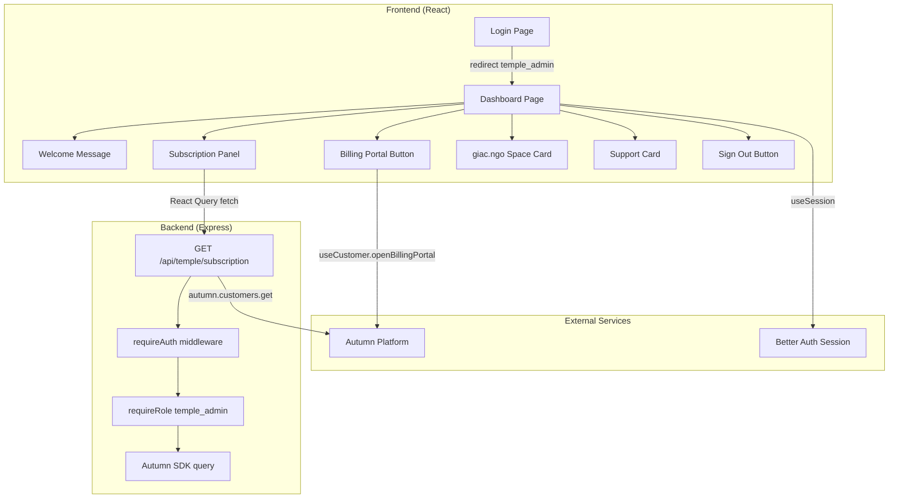
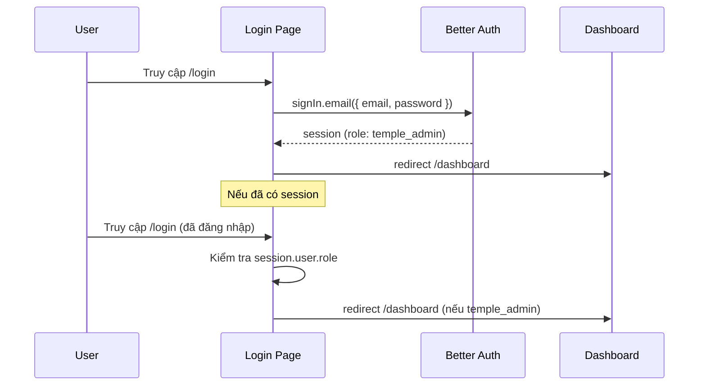
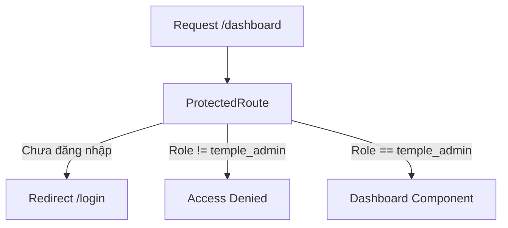
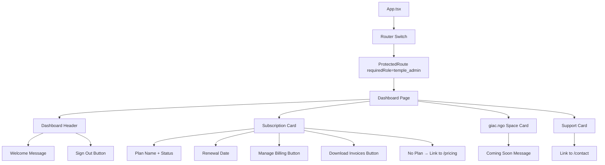

# Tài liệu Thiết kế — Temple Admin Dashboard

## Tổng quan

Tính năng Temple Admin Dashboard cung cấp cho người dùng `temple_admin` một trang quản trị tại route `/dashboard`. Tính năng bao gồm:

1. **Chuyển hướng đăng nhập** — Sau khi đăng nhập, `temple_admin` được redirect đến `/dashboard` thay vì `/`
2. **Bảo vệ route** — Route `/dashboard` chỉ cho phép `temple_admin` truy cập, sử dụng `ProtectedRoute` component hiện có
3. **Dashboard UI** — Hiển thị lời chào, thông tin gói dịch vụ, nút quản lý billing, liên kết giac.ngo Space, liên hệ hỗ trợ, và đăng xuất
4. **Backend API** — Endpoint `GET /api/temple/subscription` trả về thông tin subscription từ Autumn

### Quyết định thiết kế chính

- **Autumn SDK cho subscription data**: Sử dụng Autumn backend SDK (`autumn-js`) để query subscription thay vì lưu trữ riêng trong database. Autumn là source of truth cho billing data.
- **Tái sử dụng ProtectedRoute**: Component `ProtectedRoute` hiện có đã hỗ trợ `requiredRole` prop, chỉ cần wrap Dashboard route với `requiredRole="temple_admin"`.
- **useCustomer hook cho billing portal**: Sử dụng `useCustomer` từ `autumn-js/react` (đã có AutumnProvider trong `main.tsx`) để mở billing portal.
- **Không cần database schema mới**: Subscription data được lấy từ Autumn API, user data từ Better Auth session. Không cần thêm bảng hay cột mới.
- **Login redirect logic**: Sửa trực tiếp trong `Login.tsx` — thêm case `temple_admin` redirect đến `/dashboard`.

## Kiến trúc

### Luồng dữ liệu tổng quan



### Luồng chuyển hướng đăng nhập



### Bảo vệ route



## Thành phần và Giao diện

### 1. Sửa đổi Login Page (`client/src/pages/Login.tsx`)

Thêm logic redirect cho `temple_admin`:

```typescript
// Trong phần redirect khi đã có session:
if (session) {
  const role = (session.user as any).role;
  if (role === "bodhi_admin") return <Redirect to="/admin" />;
  if (role === "temple_admin") return <Redirect to="/dashboard" />;
  return <Redirect to="/" />;
}

// Trong handleSubmit sau khi login thành công:
const userRole = (result.data?.user as any)?.role;
if (userRole === "bodhi_admin") {
  setLocation("/admin");
} else if (userRole === "temple_admin") {
  setLocation("/dashboard");
} else {
  setLocation("/");
}
```

### 2. Dashboard Page (`client/src/pages/Dashboard.tsx`)

Component chính cho temple admin dashboard:

```typescript
// Dependencies
import { useSession, signOut } from "@/lib/auth-client";
import { useCustomer } from "autumn-js/react";
import { useQuery } from "@tanstack/react-query";
import { useLocation } from "wouter";
import { Card } from "@/components/ui/card";
import { Button } from "@/components/ui/button";

// Subscription data interface (from backend API)
interface SubscriptionInfo {
  productId: string | null;    // "basic" | "standard" | "premium" | null
  productName: string | null;
  renewalDate: string | null;  // ISO date string
  status: string | null;       // "active" | "cancelled" | etc.
}

// Component structure:
// - Header: Welcome message + Sign Out button
// - Subscription Card: Plan name + renewal date + Manage Billing button
// - giac.ngo Space Card: Placeholder with "Coming soon" message
// - Support Card: Link to /contact
```

### 3. Route Registration (`client/src/App.tsx`)

```typescript
// Thêm route mới:
import Dashboard from "@/pages/Dashboard";

<Route path="/dashboard">
  <ProtectedRoute requiredRole="temple_admin">
    <Dashboard />
  </ProtectedRoute>
</Route>
```

### 4. Backend API Endpoint (`server/routes.ts`)

```typescript
// GET /api/temple/subscription
app.get("/api/temple/subscription",
  requireAuth,
  requireRole("temple_admin"),
  async (req, res) => {
    try {
      const userId = (req as any).session.user.id;
      
      // Query Autumn for customer subscription
      const autumn = new Autumn({ secretKey: process.env.AUTUMN_SECRET_KEY });
      const { data: customer } = await autumn.customers.get(userId);
      
      // Extract active product info
      const activeProduct = customer?.products?.[0] || null;
      
      res.json({
        productId: activeProduct?.id || null,
        productName: activeProduct?.name || null,
        renewalDate: activeProduct?.current_period_end || null,
        status: activeProduct?.status || null,
      });
    } catch (error) {
      console.error("Error fetching subscription:", error);
      res.status(500).json({ 
        success: false, 
        error: "Failed to fetch subscription info" 
      });
    }
  }
);
```

### Component Hierarchy




## Mô hình Dữ liệu

### Session User (từ Better Auth)

```typescript
interface SessionUser {
  id: string;
  name: string;
  email: string;
  role: "temple_admin" | "bodhi_admin";
  // ... other Better Auth fields
}
```

### Subscription Info (API Response)

```typescript
interface SubscriptionInfo {
  productId: string | null;    // "basic" | "standard" | "premium"
  productName: string | null;  // Display name
  renewalDate: string | null;  // ISO 8601 date
  status: string | null;       // "active" | "cancelled" | "past_due" | etc.
}
```

### Plan Display Config

```typescript
interface PlanDisplayConfig {
  id: string;
  name: string;
  price: number;
}

const PLAN_DISPLAY: Record<string, PlanDisplayConfig> = {
  basic: { id: "basic", name: "Basic", price: 99 },
  standard: { id: "standard", name: "Standard", price: 199 },
  premium: { id: "premium", name: "Premium", price: 299 },
};
```

### API Endpoints

| Method | Path | Auth | Role | Response |
|--------|------|------|------|----------|
| GET | `/api/temple/subscription` | Required | `temple_admin` | `SubscriptionInfo` |

### Response Format

```typescript
// Success (200)
{
  productId: "standard",
  productName: "Standard",
  renewalDate: "2025-08-15T00:00:00Z",
  status: "active"
}

// No subscription (200)
{
  productId: null,
  productName: null,
  renewalDate: null,
  status: null
}

// Unauthorized (401)
{ success: false, error: "Unauthorized" }

// Forbidden (403)
{ success: false, error: "Forbidden" }
```

### Utility Functions (extractable for testing)

```typescript
// client/src/lib/dashboard-utils.ts

/**
 * Tạo lời chào dựa trên tên user
 */
function getWelcomeMessage(name: string | null | undefined): string;

/**
 * Format ngày gia hạn sang dạng hiển thị
 */
function formatRenewalDate(isoDate: string | null): string;

/**
 * Xác định trạng thái hiển thị subscription
 */
function getSubscriptionDisplayStatus(sub: SubscriptionInfo): {
  hasActivePlan: boolean;
  planLabel: string;
  renewalLabel: string;
};
```


## Correctness Properties

*A property is a characteristic or behavior that should hold true across all valid executions of a system — essentially, a formal statement about what the system should do. Properties serve as the bridge between human-readable specifications and machine-verifiable correctness guarantees.*

### Property 1: Role-based redirect mapping

*For any* user session with a role value, the redirect function should return `/dashboard` when role is `temple_admin`, `/admin` when role is `bodhi_admin`, and `/` for all other roles. This mapping must be consistent for both post-login redirect and already-authenticated redirect scenarios.

**Validates: Requirements 1.1, 1.2**

### Property 2: Welcome message contains user name

*For any* non-empty, non-whitespace-only name string, the `getWelcomeMessage` function should return a string that contains the provided name. For any null, undefined, or empty/whitespace-only name, it should return the default message "Welcome to your Dashboard".

**Validates: Requirements 3.1, 3.2**

### Property 3: Subscription display status

*For any* `SubscriptionInfo` object where `productId` is one of `["basic", "standard", "premium"]` and `status` is `"active"`, the `getSubscriptionDisplayStatus` function should return `hasActivePlan: true` with a non-empty `planLabel` matching the product name and a non-empty `renewalLabel`. For any `SubscriptionInfo` where `productId` is null, it should return `hasActivePlan: false`.

**Validates: Requirements 4.1, 4.2, 4.3**

### Property 4: Renewal date formatting

*For any* valid ISO 8601 date string, the `formatRenewalDate` function should return a non-empty string that does not equal the raw ISO input. For null input, it should return a fallback string (e.g., "N/A").

**Validates: Requirements 4.2**

### Property 5: API role guard rejects non-temple_admin

*For any* authenticated user whose role is not `temple_admin`, the `GET /api/temple/subscription` endpoint should return HTTP 403. The set of rejected roles includes `bodhi_admin`, any arbitrary string role, and empty string.

**Validates: Requirements 9.3**

### Property 6: API data isolation

*For any* authenticated `temple_admin` user, the `GET /api/temple/subscription` endpoint must query Autumn using exactly the authenticated user's ID from the session. The customer ID passed to Autumn must equal `session.user.id` — never a value from query parameters or request body.

**Validates: Requirements 9.1, 9.4**

## Xử lý Lỗi

### Backend Error Handling

| Tình huống | HTTP Status | Response |
|---|---|---|
| Chưa đăng nhập gọi `/api/temple/subscription` | 401 | `{ success: false, error: "Unauthorized" }` |
| Role không phải `temple_admin` | 403 | `{ success: false, error: "Forbidden" }` |
| Autumn API lỗi (network, timeout) | 500 | `{ success: false, error: "Failed to fetch subscription info" }` |
| `AUTUMN_SECRET_KEY` chưa cấu hình | 500 | `{ success: false, error: "Failed to fetch subscription info" }` |
| Autumn trả về customer không có products | 200 | `{ productId: null, productName: null, renewalDate: null, status: null }` |

### Frontend Error Handling

| Tình huống | Xử lý |
|---|---|
| API `/api/temple/subscription` trả về lỗi | Hiển thị error state trong Subscription Card với nút retry |
| API đang loading | Hiển thị skeleton/spinner trong Subscription Card |
| `openBillingPortal()` thất bại | Toast error "Unable to open billing portal" |
| `signOut()` thất bại | Toast error, giữ nguyên trạng thái |
| Session hết hạn giữa chừng | React Query refetch → 401 → ProtectedRoute redirect đến `/login` |

### Edge Cases

- **User name rỗng**: Hiển thị lời chào mặc định "Welcome to your Dashboard"
- **Subscription data null**: Hiển thị "No active plan" với link đến `/pricing`
- **Renewal date null**: Hiển thị "N/A" thay vì date
- **Autumn customer chưa tồn tại**: Trả về tất cả null fields (200 OK, không phải error)

## Chiến lược Testing

### Dual Testing Approach

Sử dụng kết hợp unit tests và property-based tests:

- **Unit tests**: Kiểm tra các ví dụ cụ thể, edge cases, UI rendering, và integration points
- **Property tests**: Kiểm tra các thuộc tính phổ quát trên nhiều input ngẫu nhiên

### Property-Based Testing

- **Thư viện**: `fast-check` (JavaScript/TypeScript PBT library)
- **Test runner**: Vitest
- **Cấu hình**: Mỗi property test chạy tối thiểu 100 iterations
- **Tag format**: `Feature: temple-dashboard, Property {number}: {property_text}`
- Mỗi correctness property được implement bởi MỘT property-based test duy nhất

### Property Test Map

| Property | Test Target | Approach |
|---|---|---|
| Property 1: Role-based redirect | `getRedirectPath(role)` utility function | Generate random role strings, verify mapping |
| Property 2: Welcome message | `getWelcomeMessage(name)` utility function | Generate random strings + null/whitespace, verify contains name or default |
| Property 3: Subscription display | `getSubscriptionDisplayStatus(sub)` utility function | Generate random SubscriptionInfo objects, verify hasActivePlan and labels |
| Property 4: Renewal date formatting | `formatRenewalDate(date)` utility function | Generate random valid ISO dates + null, verify non-empty output |
| Property 5: API role guard | `requireRole("temple_admin")` middleware | Generate random non-temple_admin role strings, verify 403 |
| Property 6: API data isolation | `GET /api/temple/subscription` handler | Generate random user IDs, verify Autumn called with session user ID |

### Unit Tests

Unit tests tập trung vào:

- **Login redirect**: Verify `temple_admin` redirect đến `/dashboard` (example test cho 1.1)
- **Dashboard rendering**: Verify các card hiển thị đúng (giac.ngo Space, Support, Billing buttons)
- **Sign out flow**: Verify `signOut()` được gọi và redirect đến `/login`
- **ProtectedRoute**: Verify redirect khi chưa đăng nhập, Access Denied khi sai role
- **API endpoint**: Verify 401 khi chưa auth, 403 khi sai role, 200 với data đúng

### Các hàm cần extract để test

Để property-test được, các logic functions cần được extract ra file utility riêng:

```
client/src/lib/dashboard-utils.ts
├── getRedirectPath(role: string): string
├── getWelcomeMessage(name: string | null | undefined): string
├── formatRenewalDate(isoDate: string | null): string
└── getSubscriptionDisplayStatus(sub: SubscriptionInfo): DisplayStatus
```

### Test Files

```
client/src/__tests__/
├── dashboard-utils.property.test.ts   # Property tests cho utility functions
├── dashboard-page.test.tsx            # Unit tests cho Dashboard component
└── login-redirect.test.tsx            # Unit tests cho login redirect logic

server/__tests__/
└── temple-subscription.test.ts        # Unit + property tests cho API endpoint
```
