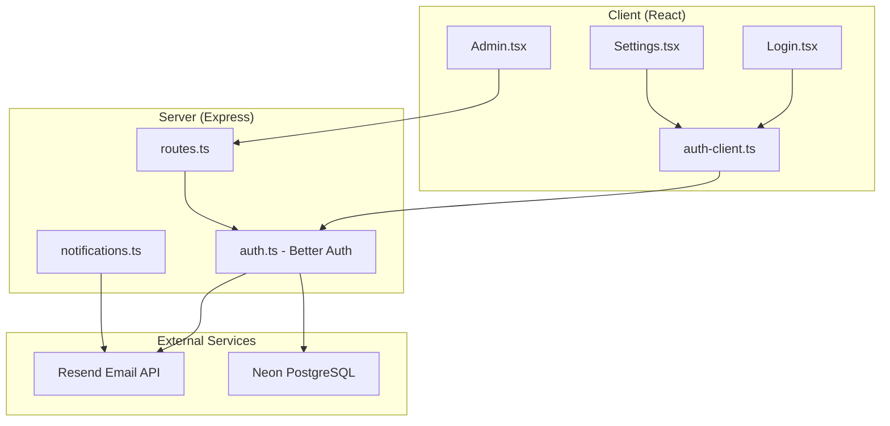
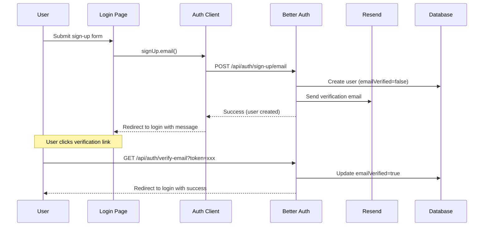
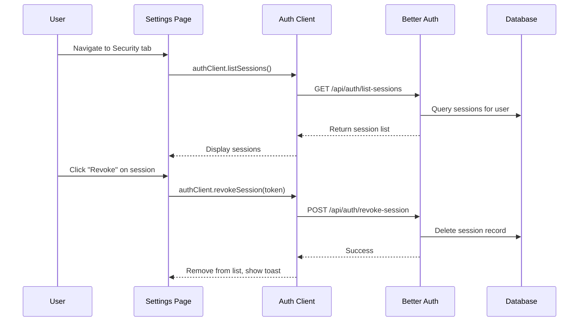

# Design Document: User Account Enhancements

## Overview

This design implements comprehensive user account management features for the Bodhi Technology Lab platform. The feature set includes email verification enforcement, temple admin onboarding workflows, a user settings page, and session security controls.

The implementation leverages Better Auth's built-in capabilities for email verification, password management, and session handling, while extending the platform with custom email templates and a new Settings page that follows the established design system.

### Key Design Decisions

1. **Better Auth Native APIs**: Use `authClient.sendVerificationEmail()`, `authClient.changePassword()`, `authClient.updateUser()`, `authClient.listSessions()`, and `authClient.revokeSession()` rather than custom implementations
2. **Email Service Reuse**: Extend the existing Resend integration in `server/lib/auth.ts` for welcome and invitation emails
3. **Unified Settings Page**: Single `/settings` route with tabbed sections for Profile, Security, and Sessions
4. **Rate Limiting**: Server-side rate limiting for verification email resends (3 per 15 minutes)
5. **No Account Deletion**: Intentionally omit any self-service account deletion functionality

## Architecture



### Request Flow: Email Verification



### Request Flow: Session Management



## Components and Interfaces

### Client Components

#### Settings Page (`client/src/pages/Settings.tsx`)

New page component with three sections:

```typescript
interface SettingsPageProps {}

// Internal state
interface SettingsState {
  activeTab: 'profile' | 'security' | 'sessions';
  isLoading: boolean;
  error: string | null;
}
```

**Profile Section:**
- Display current name (editable), email (read-only), role (read-only)
- Name update form with save button
- Change email form (triggers verification flow)

**Security Section:**
- Change password form (current password, new password, confirm)
- Password requirements display (min 8 characters)

**Sessions Section:**
- List of active sessions with device info
- Current session indicator
- Individual revoke buttons
- "Sign out all other devices" button

#### Login Page Updates (`client/src/pages/Login.tsx`)

Add resend verification email functionality:

```typescript
// New state additions
const [showResendVerification, setShowResendVerification] = useState(false);
const [resendEmail, setResendEmail] = useState('');
const [resendLoading, setResendLoading] = useState(false);
const [resendCooldown, setResendCooldown] = useState(0);
```

#### Admin Page Updates (`client/src/pages/Admin.tsx`)

Add invite temple admin modal:

```typescript
interface InviteModalState {
  isOpen: boolean;
  name: string;
  email: string;
  isSubmitting: boolean;
  error: string | null;
}
```

### Server Components

#### Auth Configuration Updates (`server/lib/auth.ts`)

```typescript
// Enable email verification
emailAndPassword: {
  enabled: true,
  requireEmailVerification: true, // Changed from false
  minPasswordLength: 8,
  autoSignIn: false, // Changed - don't auto sign in, require verification
}

emailVerification: {
  sendOnSignUp: true, // Changed from false
  autoSignInAfterVerification: true,
  expiresIn: 86400, // 24 hours
  sendVerificationEmail: async ({ user, url }) => { /* existing */ }
}
```

#### New API Endpoints (`server/routes.ts`)

```typescript
// POST /api/admin/invite-temple-admin
interface InviteTempleAdminRequest {
  name: string;
  email: string;
}

interface InviteTempleAdminResponse {
  success: boolean;
  message: string;
  userId?: string;
}

// POST /api/auth/resend-verification (rate-limited)
interface ResendVerificationRequest {
  email: string;
}

interface ResendVerificationResponse {
  success: boolean;
  message: string;
}
```

#### Email Templates (`server/services/notifications.ts`)

New functions to add:

```typescript
// Send welcome email to new temple admins
async function sendWelcomeEmail(user: { name: string; email: string }): Promise<void>

// Send invitation email to invited temple admins
async function sendInvitationEmail(params: {
  email: string;
  name: string;
  inviterName: string;
  setPasswordUrl: string;
}): Promise<void>
```

### Auth Client Exports (`client/src/lib/auth-client.ts`)

Add missing exports:

```typescript
export const {
  useSession,
  signIn,
  signUp,
  signOut,
  requestPasswordReset,
  resetPassword,
  sendVerificationEmail,
  changePassword,
  updateUser,        // Add
  listSessions,      // Add
  revokeSession,     // Add
  revokeSessions,    // Add
  changeEmail,       // Add
} = authClient;
```

## Data Models

### Existing Tables (No Changes Required)

The existing Better Auth schema already supports all required functionality:

**`user` table:**
- `emailVerified: boolean` - Tracks verification status
- `name: text` - Editable user name
- `email: text` - User email (unique)
- `role: text` - User role (temple_admin, bodhi_admin)

**`session` table:**
- `id: text` - Session identifier
- `token: text` - Session token for revocation
- `ipAddress: text` - Client IP for location approximation
- `userAgent: text` - Browser/device info
- `createdAt: timestamp` - Session creation time
- `expiresAt: timestamp` - Session expiration

**`verification` table:**
- `identifier: text` - Email address
- `value: text` - Verification token
- `expiresAt: timestamp` - Token expiration (24h for verification, 72h for invites)

### Rate Limiting Storage

For verification email rate limiting, use in-memory storage with the existing verification table:

```typescript
// In-memory rate limit tracking (server restart clears)
const verificationRateLimits = new Map<string, { count: number; resetAt: Date }>();

// Check: max 3 requests per 15 minutes per email
function checkRateLimit(email: string): { allowed: boolean; retryAfter?: number }
```

### Session Display Data

Better Auth's `listSessions` returns:

```typescript
interface SessionInfo {
  id: string;
  token: string;
  createdAt: Date;
  updatedAt: Date;
  expiresAt: Date;
  ipAddress: string | null;
  userAgent: string | null;
  // Derived on client:
  // - deviceType (parsed from userAgent)
  // - browserName (parsed from userAgent)
  // - isCurrent (compared to current session token)
}
```


## Correctness Properties

*A property is a characteristic or behavior that should hold true across all valid executions of a system—essentially, a formal statement about what the system should do. Properties serve as the bridge between human-readable specifications and machine-verifiable correctness guarantees.*

### Property 1: Sign-up triggers verification email

*For any* valid user sign-up with a valid email address, the system should send a verification email to that address.

**Validates: Requirements 1.1**

### Property 2: Unverified users cannot sign in

*For any* user with `emailVerified=false`, attempting to sign in should fail with an error indicating verification is required.

**Validates: Requirements 1.2**

### Property 3: Verification token expiration

*For any* verification token, it should be valid for exactly 24 hours from creation, after which verification attempts should fail.

**Validates: Requirements 1.3**

### Property 4: Valid verification marks email verified

*For any* valid (non-expired) verification token, clicking the verification link should update the user's `emailVerified` to `true`.

**Validates: Requirements 1.4**

### Property 5: Resend verification sends email

*For any* unverified user requesting a verification email resend (within rate limits), a new verification email should be sent to their registered address.

**Validates: Requirements 2.2**

### Property 6: Verification email rate limiting

*For any* email address, after 3 verification email requests within a 15-minute window, subsequent requests should be rejected until the window resets.

**Validates: Requirements 2.4**

### Property 7: Welcome email for temple admins

*For any* user with `temple_admin` role completing email verification, a welcome email should be sent containing the user's name, a dashboard link, and platform design styling (serif font, #991b1b accent).

**Validates: Requirements 3.1, 3.2, 3.3**

### Property 8: Invite creates temple admin user

*For any* valid invite submission by a bodhi_admin (with name and non-duplicate email), a new user should be created with `role='temple_admin'` and `emailVerified=false`.

**Validates: Requirements 4.3**

### Property 9: Invitation email sent with correct content

*For any* successful temple admin invite, an invitation email should be sent containing the inviter's context and a password-set link that expires after 72 hours.

**Validates: Requirements 4.4, 4.5**

### Property 10: Settings page accessible to authenticated users

*For any* authenticated user (regardless of role), the `/settings` route should be accessible and return the settings page.

**Validates: Requirements 5.1**

### Property 11: Settings displays user data

*For any* authenticated user viewing the settings page, their current name, email, and role should be displayed.

**Validates: Requirements 5.2**

### Property 12: Name update persists

*For any* valid name update submitted through settings, the user's name in the database should be updated to the new value.

**Validates: Requirements 5.3**

### Property 13: Email change triggers verification

*For any* email change request with a valid new email address, a verification email should be sent to the new address.

**Validates: Requirements 6.2**

### Property 14: Email change round-trip

*For any* email change request, the original email should remain the user's active email until the new email is verified, at which point the user's email should be updated to the new address.

**Validates: Requirements 6.3, 6.4**

### Property 15: Password change requires current password

*For any* password change request, the system should verify the current password matches before updating. If incorrect, the change should be rejected.

**Validates: Requirements 7.2**

### Property 16: Password minimum length validation

*For any* new password under 8 characters, the password change should be rejected with a validation error.

**Validates: Requirements 7.4**

### Property 17: Session list contains required info

*For any* session returned by `listSessions`, the response should include device type (parsed from userAgent), browser name, last active timestamp, and IP address for location approximation.

**Validates: Requirements 8.2**

### Property 18: Non-current sessions have revoke option

*For any* session in the list that is not the current session, a revoke action should be available.

**Validates: Requirements 9.1**

### Property 19: Session revocation invalidates session

*For any* session revocation request, the targeted session should be immediately invalidated and removed from the database.

**Validates: Requirements 9.2**

### Property 20: Bulk session revocation

*For any* "sign out all other devices" action, all sessions except the current session should be invalidated.

**Validates: Requirements 9.5**

## Error Handling

### Authentication Errors

| Error Scenario | User-Facing Message | Technical Handling |
|----------------|---------------------|-------------------|
| Unverified email on sign-in | "Please verify your email before signing in. Check your inbox for the verification link." | Return 403 with `EMAIL_NOT_VERIFIED` code |
| Expired verification token | "This verification link has expired. Please request a new one." | Return 400 with `TOKEN_EXPIRED` code |
| Invalid verification token | "This verification link is invalid." | Return 400 with `INVALID_TOKEN` code |
| Rate limit exceeded (resend) | "Too many requests. Please wait X minutes before requesting another email." | Return 429 with `retryAfter` seconds |
| Duplicate email (invite) | "This email is already registered." | Return 409 with `EMAIL_EXISTS` code |
| Duplicate email (change) | "This email is already in use by another account." | Return 409 with `EMAIL_EXISTS` code |
| Wrong current password | "Password change failed. Please check your current password." | Return 400, generic message (no field hint) |
| Password too short | "Password must be at least 8 characters." | Return 400 with validation error |
| Password mismatch | "Passwords do not match." | Client-side validation before submit |
| Session revocation failed | "Could not sign out this device. Please try again." | Return 500, allow retry |

### Email Delivery Errors

| Error Scenario | Handling |
|----------------|----------|
| Verification email fails | Log error, return success to user (email may be delayed) |
| Welcome email fails | Log error, do not block user access |
| Invitation email fails | Log error, return error to admin, allow retry |

### Network/Server Errors

- All API calls should have client-side timeout handling (10 seconds)
- Display generic "Something went wrong. Please try again." for unexpected errors
- Include retry buttons where appropriate (session list, email resend)

## Testing Strategy

### Property-Based Testing

Use `fast-check` for property-based testing in TypeScript. Each property test should run minimum 100 iterations.

**Test Configuration:**
```typescript
import fc from 'fast-check';

// Configure minimum runs
const testConfig = { numRuns: 100 };
```

**Properties to implement as PBT:**

1. **Email verification flow** (Properties 1-4): Generate random valid emails, test sign-up → verification → sign-in flow
2. **Rate limiting** (Property 6): Generate sequences of resend requests, verify rate limit enforcement
3. **User creation via invite** (Properties 8-9): Generate random name/email pairs, verify user creation
4. **Password validation** (Properties 15-16): Generate random passwords, verify validation rules
5. **Session management** (Properties 19-20): Generate session lists, verify revocation behavior

**Tag format for property tests:**
```typescript
// Feature: user-account-enhancements, Property 2: Unverified users cannot sign in
```

### Unit Tests

Focus unit tests on:

1. **Email template rendering**: Verify welcome and invitation emails contain required elements
2. **User agent parsing**: Test device/browser extraction from various user agent strings
3. **Rate limit calculation**: Test time window and count logic
4. **Input validation**: Test email format, password length, name constraints

### Integration Tests

1. **Sign-up to verification flow**: End-to-end test of user registration
2. **Invite flow**: Admin invites user → user sets password → user signs in
3. **Settings page operations**: Name update, password change, session revocation
4. **Email change flow**: Request change → verify new email → confirm update

### Edge Cases to Cover

- Expired verification tokens (24h boundary)
- Expired invitation tokens (72h boundary)
- Rate limit boundary (3rd vs 4th request)
- Rate limit window reset (15 minute boundary)
- Concurrent session revocation
- Self-revocation attempt (should be prevented)
- Empty/whitespace name updates
- Email change to same email
- Password change with same password
